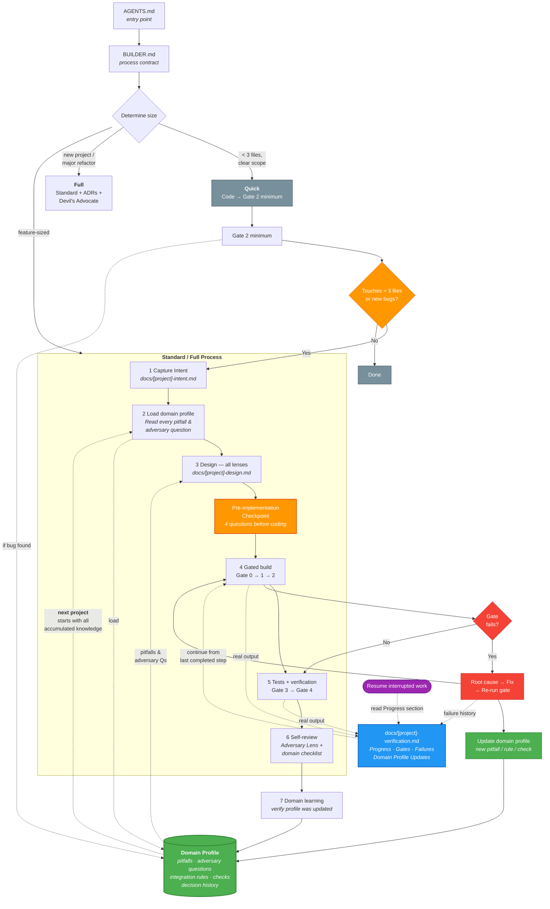

# Agent Kit

A process framework for LLM-assisted software development. Works with any LLM and any technology stack.

## The problem

LLMs make the same mistakes across projects. They skip verification, forget past lessons, lose context between sessions, and build confidently on wrong assumptions. Each new conversation starts from zero — even when the same stack was used yesterday.

Agent Kit solves this with two mechanisms:

1. **A structured process** that forces the LLM to pause, verify, and prove its work before moving forward.
2. **Domain profiles** — living documents that accumulate stack-specific knowledge across projects. Every bug fix, every gate failure, every discovery enriches the profile. The next project on the same stack starts knowing what the last one learned.

## How the process works

**Reading the diagram:**
- **Green** = Domain Profile — the learning mechanism. Knowledge flows in (from failures) and out (to future projects).
- **Blue** = Verification Log — the proof mechanism. Real command output, not assumptions.
- **Orange** = Checkpoints — points where the LLM must pause and think before acting.
- **Red** = Failure path — failures are captured, root-caused, and fed back into the profile.
- **Purple** = Resume — interrupted sessions recover from the verification log's Progress section.
- The dashed line from Domain Profile back to "Load domain profile" is the **learning cycle**: every project starts with the accumulated knowledge of all previous projects on that stack.

## The four lenses

The LLM doesn't follow a linear sequence. It applies four thinking modes whenever they're relevant:

**User Lens** — What does the software need to do? Extracts goals, implicit needs, and explicit rejections from the prompt. This produces the Intent document — the anchor everything traces back to.

**Architecture Lens** — How should it be built? Component structure, data flow, dependency tree, initialization chain. Every choice needs a reason and rejected alternatives. The LLM reads the public API of every dependency before implementing — if a library already provides the functionality, it uses it.

**Adversary Lens** — What could go wrong? Applied *during* design, not only after. "What input breaks this?", "What happens when X is unavailable?", "What would a careless developer get wrong?" If the domain profile has adversary questions, they must be answered against the specific design before any code is written.

**Domain Lens** — What does the domain profile say? Checks every pitfall, follows integration rules, runs automated checks. The accumulated knowledge of previous projects on this stack.

## Domain profiles: the learning mechanism

Domain profiles are the most valuable artifact in the framework. They are its memory.

A domain profile captures everything an LLM needs to know about a specific technology stack: what commands to run, what mistakes to avoid, what questions to ask before coding, what to check during review. Each section exists because a real project needed it.

### The flywheel effect

The first project on a new stack creates a minimal profile — terminology, verification commands, a couple of pitfalls. Then something breaks. The LLM root-causes the failure, fixes it, and adds the lesson to the profile. By the end of the first project, the profile has grown.

The second project on the same stack loads that profile. The failures from project 1 are now prevented. New discoveries from project 2 further enrich it. And so on.

From real usage: a domain profile started with 3 pitfalls. After two projects, it had 11 pitfalls, 7 adversary questions, and 8 decision history entries — all learned from real bugs. The second project had significantly fewer gate failures because the profile already knew what to watch for.

### What makes them different from documentation

Documentation describes how things work. Domain profiles describe how things *fail* — and what to do about it. They are written by the LLM during implementation, not by a human before it. They grow from experience, not from planning.

They also travel. Copy a profile to a new repository and every project in that repo inherits the knowledge. Different LLMs can use the same profile. The learning persists regardless of which model or session created it.

## Verification: proof over claims

LLMs are confident. They will tell you "everything works" when it doesn't. The framework addresses this with gates — mandatory checkpoints where the LLM runs a real command, pastes the real output, and records it in the verification log.

"Assumed to pass" is never valid evidence. If the output isn't in the log, it didn't happen.

Gates also create a recovery mechanism. Each verification log has a Progress section at the top. When a session is interrupted — context limit, network issue, next morning — the new session reads Progress and continues from the last completed step. No rework, no guessing.

## Why artifacts matter

The framework produces three documents per project:

- **Intent** — captures *what* and *why*. The anchor for scope.
- **Design** — captures *how*. Architecture, decisions, risks, and how domain pitfalls are addressed.
- **Verification Log** — captures *proof*. Real gate output, failure history, and progress state.

These aren't bureaucracy. They exist because LLMs lose context. The Intent prevents scope creep. The Design prevents the LLM from re-deciding things it already decided. The Verification Log prevents it from re-running gates that already passed. Together, they make the process resilient to the reality of working with LLMs: limited context windows, interrupted sessions, and confident hallucinations.

## LLM compatibility

The framework is LLM-agnostic. Any model that can read markdown and follow instructions can use it.

## Getting started

See [**GUIDE.md**](GUIDE.md) for a step-by-step tutorial on setting up and using Agent Kit.

See [**framework/README.md**](framework/README.md) for the technical reference — file descriptions, gate definitions, artifact specs, and the domain profile contract.

## Included examples

**Domain profiles:** The [`catalog/`](catalog/) directory contains community-contributed domain profiles built from real projects:

- [`apps-sdk-mcp-lit-vite.md`](catalog/apps-sdk-mcp-lit-vite.md) — MCP Apps + Lit + Vite. 11 pitfalls, 7 adversary questions. Shows what a mature profile looks like after the flywheel has turned.
- [`web-kinu-preact-vite.md`](catalog/web-kinu-preact-vite.md) — Kinu + Preact + Vite. 4 pitfalls, 4 adversary questions.

Copy any relevant profile from `catalog/` into your project's `framework/domains/` to start with accumulated knowledge.

## License

MIT
