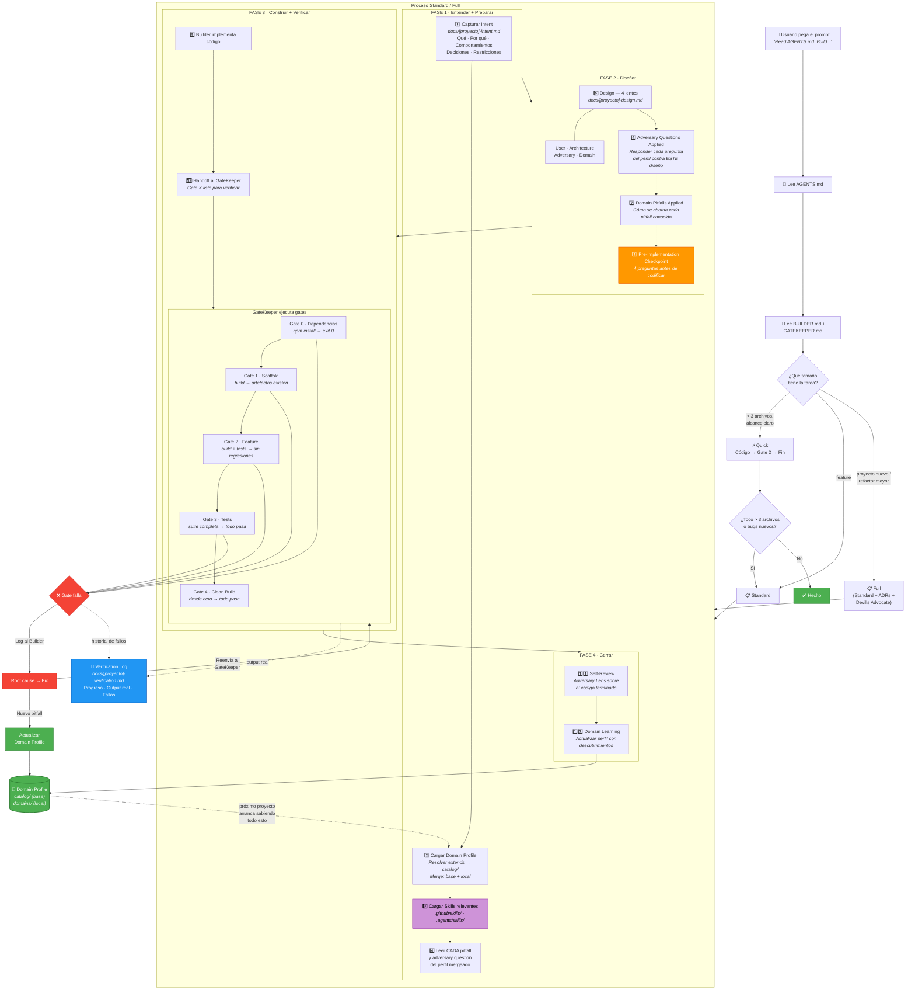

# Paso a paso: qué ocurre cuando pegas un prompt

Este documento describe la secuencia completa desde que escribes un prompt hasta que el proyecto está terminado y verificado. Cubre el flujo **Standard/Full** (el más completo). El flujo Quick es una versión reducida que salta directamente a código + Gate 2.

---

## Diagrama general



---

## Paso a paso detallado

### ARRANQUE — El prompt activa la cadena

**Paso 0: El usuario pega el prompt**

```
Read AGENTS.md. Build a task management widget.
Stack: Lit 3, Vite, TypeScript, MCP SDK.
```

La línea `Read AGENTS.md` es el disparador. Sin ella, el LLM no sabe que existe el framework.

**Paso 0.1: El LLM lee AGENTS.md**

AGENTS.md contiene solo 5 líneas. Le dice al LLM:
- Para diseñar e implementar → lee `framework/BUILDER.md`
- Para verificar → lee `framework/GATEKEEPER.md`
- Los artefactos van en `docs/`

**Paso 0.2: El LLM lee BUILDER.md**

BUILDER.md es el contrato de proceso completo. El LLM absorbe:
- Las 4 lentes (User, Architecture, Adversary, Domain)
- Las 3 escalas (Quick, Standard, Full)
- El protocolo de gates
- Las reglas de domain profiles (modelo de herencia)
- La Anti-Loop Rule

**Paso 0.3: Clasificación por tamaño**

El LLM evalúa el prompt:

| Tamaño | Criterio | Qué produce |
|--------|----------|-------------|
| **Quick** | < 3 archivos, alcance obvio | Código + Gate 2 |
| **Standard** | Feature. Hay decisiones de diseño | Intent + Design + Código + Verification Log |
| **Full** | Proyecto nuevo o refactor mayor | Todo de Standard + ADRs + Devil's Advocate |

> Regla: en caso de duda, sube un nivel. Es más barato documentar de más que descubrir tarde que faltaba una decisión.

---

### FASE 1 — Entender

**Paso 1: Capturar el Intent**

El LLM crea `docs/[proyecto]-intent.md` ANTES de investigar más (Anti-Loop Rule). Extrae del prompt:

- **Goal** — Qué y por qué (1-2 frases)
- **Behavior** — Comportamientos observables en formato given/when/then
- **Decisions** — Decisiones tomadas con alternativas rechazadas
- **Constraints** — MUST / MUST NOT / SHOULD
- **Scope** — Qué entra (IN) y qué queda fuera (OUT)
- **Acceptance** — Condiciones verificables de "terminado"

Si algo no está claro, lo escribe como pregunta abierta y **pregunta al humano**. No asume.

> Este es tu momento de corregir rumbo. Si una decisión es incorrecta, dilo ahora.

**Paso 2: Cargar el Domain Profile (modelo de herencia)**

El LLM busca en `framework/domains/`:

1. Encuentra un archivo (ej. `mi-proyecto.md`) con un campo `extends: apps-sdk-mcp-lit-vite`
2. Carga el perfil base desde `catalog/apps-sdk-mcp-lit-vite.md`
3. Aplica las reglas de merge:
   - **Local Pitfalls** y **Local Adversary Questions** → se **añaden** a las del base
   - **Local Overrides** → **reemplazan** la sección correspondiente del base
   - **Local Decision History** → se mantiene separado
   - Todo lo demás → se hereda del base sin cambios

Si no existe ningún perfil → el LLM crea uno nuevo completo en `catalog/` y luego un link en `domains/`.

**Paso 3: Cargar Skills relevantes**

El LLM busca en `.github/skills/` y `.agents/skills/` archivos `SKILL.md`. Lee la `description` de cada uno y carga los que encajan con la tarea. Por ejemplo, una skill `frontend-design` se carga para tareas de UI pero se ignora para una API backend.

Las skills son guidance de diseño y calidad — no reemplazan el proceso del framework ni los domain profiles. Si no hay skills instaladas, se salta este paso.

> En proyectos **Full**, este paso es obligatorio. Si no hay skills, se documenta "ninguna encontrada".

**Paso 4: Leer cada pitfall y adversary question**

No basta con "cargar" el perfil. El LLM lee activamente cada pitfall y cada adversary question del perfil mergeado. Estos informan el diseño — cargar sin leer es inútil.

---

### FASE 2 — Diseñar

**Paso 5: Design Document — las 4 lentes en un solo pase**

El LLM crea `docs/[proyecto]-design.md` aplicando las 4 lentes simultáneamente:

| Lente | Pregunta central | Qué produce |
|-------|-----------------|-------------|
| **User** | ¿Qué debe hacer el software? | Goals, behaviors, needs implícitas |
| **Architecture** | ¿Cómo se construye? | Stack, estructura, data flow, init chain, dependencias |
| **Adversary** | ¿Qué puede salir mal? | Risks, edge cases, assumptions cuestionables |
| **Domain** | ¿Qué dice el perfil? | Pitfalls aplicados, integration rules, terminología |

El Design incluye:
- **Domain Profile Selection Rationale** — Por qué se eligió este perfil (con scores)
- **Skills Loaded** — Qué skills se cargaron (o "ninguna")
- **Stack** — Tecnologías con versiones verificadas (`npm view`)
- **Architecture** — Estructura, data flow, init chain
- **Decisions** — Cada decisión arquitectónica con alternativas rechazadas
- **Risks** — Identificados ANTES de implementar

**Paso 6: Adversary Questions Applied** (sección obligatoria)

Cada adversary question del perfil se responde contra ESTE diseño específico:

| Pregunta del perfil | Respuesta para este diseño |
|---------------------|---------------------------|
| "¿Qué pasa si `document.referrer` está vacío?" | "No aplica — usamos SDK `App` class que usa `postMessage`" |

> Checking pitfalls ≠ answering adversary questions. Son secciones separadas con propósitos distintos.

**Paso 7: Domain Pitfalls Applied** (sección obligatoria)

Para cada pitfall del perfil: ¿aplica? ¿cómo se aborda?

| Pitfall | ¿Aplica? | Cómo se aborda |
|---------|----------|----------------|
| Attribute binding for non-strings | Sí | Property binding en todos los casos |
| CORS en widget assets | Sí | CSP configurado en `_meta.ui` |

**Paso 8: Pre-Implementation Checkpoint**

4 preguntas antes de escribir una sola línea de código:

1. **¿Mis dependencias ya resuelven esto?** — Lee la API pública. Si la librería lo ofrece, úsala.
2. **¿Qué assumption del entorno podría estar mal?** — Identifica al menos una.
3. **¿He revisado los pitfalls del perfil?** — Cada pitfall y adversary question contra el plan.
4. **¿Sigue siendo el tamaño correcto?** — Re-evalúa Quick vs Standard vs Full.

> No es un documento. Es una pausa mental — existe porque los LLMs bajo presión se la saltan.

---

### FASE 3 — Construir y verificar

**Paso 9: El Builder implementa código**

El Builder escribe código siguiendo el Design. El código va en su propio directorio (ej. `mcp-task-widget/`), nunca en la raíz del repo.

**Paso 10: Handoff adversarial al GateKeeper**

El Builder **nunca verifica su propio trabajo**. Cuando una fase está lista:

1. Declara: *"Gate X listo para verificar"*
2. **Para.** No ejecuta comandos de verificación.
3. El GateKeeper toma el control.

> Esta separación elimina las auto-aprobaciones alucinadas.

**Paso 10.1: El GateKeeper ejecuta los gates**

El GateKeeper es un agente estrictamente mecánico:

| Gate | Qué verifica | Criterio de paso |
|------|-------------|-----------------|
| **0** | Dependencias | `npm install` → exit 0, sin warnings de dependencias |
| **1** | Scaffold | Build → exit 0, artefactos existen en disco |
| **2** | Feature | Build + tests → exit 0, sin regresiones |
| **3** | Tests | Suite completa → todo pasa, coverage cumple target |
| **4** | Clean Build | Desde cero (borrar todo → install → build → test) → todo pasa |

Para cada gate, el GateKeeper:
1. Lee los comandos del Domain Profile
2. Los ejecuta en terminal
3. Captura STDOUT/STDERR + exit code
4. Pega el output real en `docs/[proyecto]-verification.md`

> "Assumed to pass" nunca es evidencia válida. Output real o no ocurrió.

**Paso 10.2: Qué pasa cuando un gate falla**

```
[GATE REJECTED]
Gate: 2
Exit Code: 1
Raw Output:
<output exacto del terminal>
Action Required: Builder must analyze the root cause and resubmit.
```

1. El GateKeeper reporta el fallo con el log crudo
2. El Builder analiza la **causa raíz** (no el síntoma)
3. El Builder corrige el código
4. El Builder reenvía al GateKeeper
5. El GateKeeper re-ejecuta el gate desde cero
6. Si el fallo reveló un gap → **el GateKeeper actualiza el Domain Profile** con un nuevo pitfall

> Cada fallo es una oportunidad de aprendizaje. Un fix sin actualización del perfil significa que el mismo error puede repetirse en el próximo proyecto.

**Paso 10.3: Qué pasa cuando un gate pasa**

```
[GATE PASSED]
The verification log has been updated with the mechanical proof.
```

El GateKeeper actualiza la tabla de Progress y avanza al siguiente gate.

---

### FASE 4 — Cerrar

**Paso 11: Self-Review**

El Builder cambia a lente Adversary sobre el código terminado:

1. Re-lee el Intent. ¿El código cumple cada Behavior? ¿Respeta cada Constraint?
2. Ejecuta cada Automated Check del perfil
3. Revisa cada Common Pitfall contra el código
4. Verifica cada item del Review Checklist

Para proyectos **Full**, añade:
- **Devil's Advocate** — 3 escenarios no cubiertos, eslabón más débil, vector de ataque
- **Findings** — Mínimo 3 hallazgos genuinos

**Paso 12: Domain Learning**

El Builder verifica que el Domain Profile se actualizó durante la implementación. Si algo se pasó por alto, lo actualiza ahora:

| Dónde va | Qué tipo de descubrimiento |
|----------|---------------------------|
| **catalog/** (base) | Pitfalls de stack, adversary questions, integration rules, decision history |
| **domains/** (local) | Pitfalls únicos de este proyecto, overrides de gates, decisiones locales |

---

### El resultado final

Al terminar, tienes:

```
docs/
├── [proyecto]-intent.md          ← Qué y por qué
├── [proyecto]-design.md          ← Cómo (arquitectura, decisiones, riesgos)
└── [proyecto]-verification.md    ← Prueba (output real de cada gate)

catalog/
└── [perfil].md                   ← Actualizado con lo aprendido (stack-wide)

framework/domains/
└── [proyecto].md                 ← Actualizado con lo aprendido (project-specific)
```

Y la tabla de Progress del verification log muestra:

```
| Step                   | Status |
|------------------------|--------|
| Intent                 | PASS   |
| Skills loaded          | PASS   |
| Design                 | PASS   |
| Gate 0: Dependencies   | PASS   |
| Gate 1: Scaffold       | PASS   |
| Gate 2: Feature        | PASS   |
| Gate 3: Tests          | PASS   |
| Gate 4: Clean build    | PASS   |
| Self-Review            | PASS   |
| Domain update          | PASS   |
```

---

### Si la sesión se interrumpe

El LLM de la siguiente sesión:

1. Lee `AGENTS.md` → `BUILDER.md`
2. Busca `docs/[proyecto]-verification.md`
3. Lee la sección **Progress** — encuentra el último paso completado
4. Carga el domain profile del design doc
5. Continúa desde el siguiente paso incompleto

No repite trabajo. No adivina.

---

### El flywheel

El Domain Profile es el artefacto más valioso. Después del primer proyecto:

```
Proyecto 1: 3 pitfalls  →  perfil crece a 11 pitfalls, 7 adversary questions
Proyecto 2: carga ese perfil  →  significativamente menos fallos de gate
Proyecto 3: carga el perfil enriquecido  →  aún más suave
```

Cada proyecto alimenta al siguiente. El conocimiento no se pierde entre sesiones, entre proyectos, ni entre LLMs diferentes.
